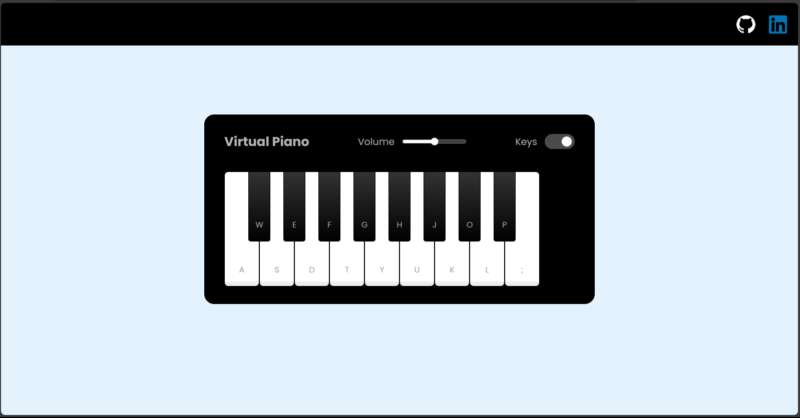
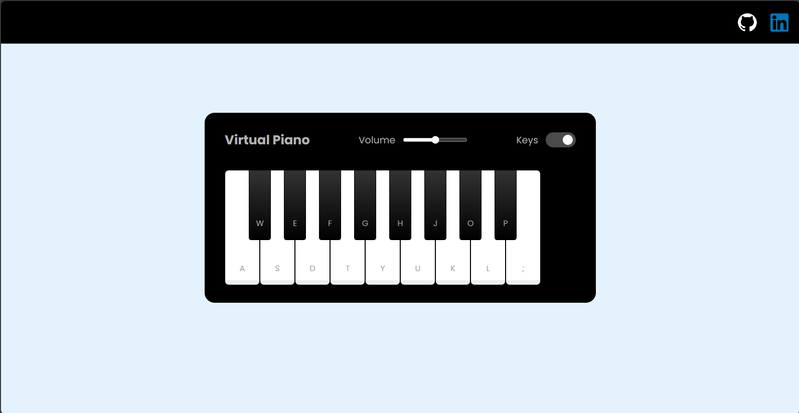

# JS Piano Simulator 🎹
A musical keyboard virtual made with JS Vanilla, with volume control and the option to turn on or disable the letters that identify the keys.

## 🎮 Ready?
[Click here to try it](coloque_aqui_o_seu_link)

    
    
 Piano with the letters on the active keys

 

    
    
  Piano with the letters on the keys disabled

